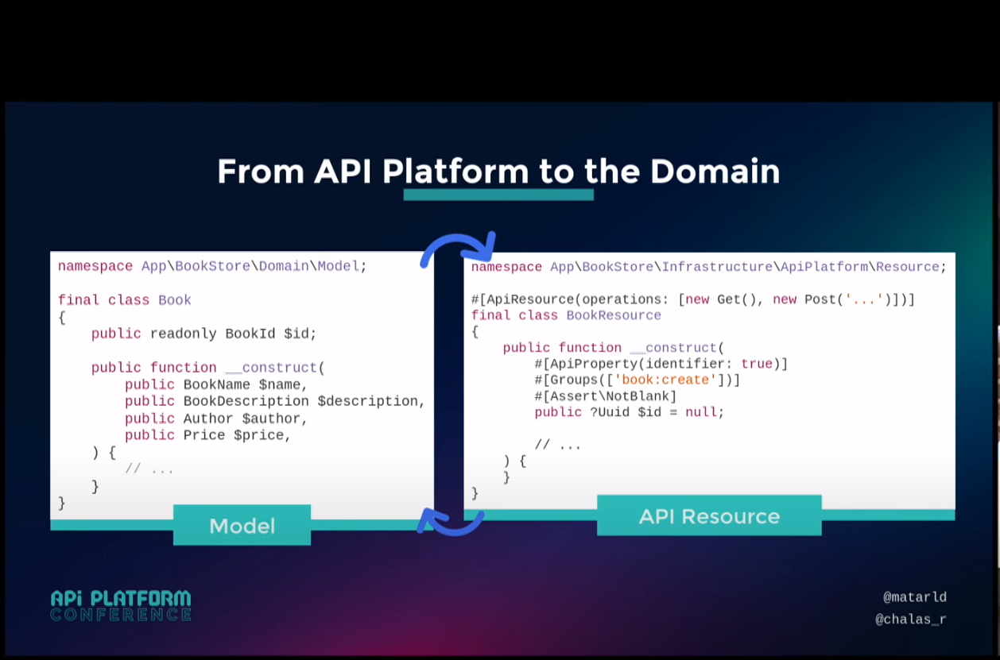

# Objectif 

Créer un service web de discussion et de commentaires d'artciles

## Fonctionnalités:

### Backend :

• Consulter la liste des commentaires et les réponses aux commentaires\
• Poster un commentaire\
• Poster une réponse a un commentaire\
• Créer un système de notation des commentaire\
• Mettre en place un système d’autorisation sur les API

### Infra / Frontend :

• Pouvoir instancier le service de commentaires sur n’importe quelle page\
• Sécuriser le formulaire de post de commentaires contre les robots\
• S’authentifier via Facebook et/ou Google

### Frontend:
- Le choix a été fait de faire un frontend qui soit une application Symfony pour passer moins de temps
mais il est tout à fait faisable de mettre en place la solution qui vous convient le mieux. Un IDP, connexion
oAuth2 ou Oidc-connect via un petit service de SSO.

### Notes:

- La branche hexagone contient le model isolé de manière à construire une [architecture hexagonale](https://fr.wikipedia.org/wiki/Architecture_hexagonale)
- La branch CQRS implémente le pattern [CQRS](https://fr.wikipedia.org/wiki/S%C3%A9paration_commande-requ%C3%AAte) de séparation
des commandes et requêtes

Dans le cadre d'un service dédié, ces choix techniques spécifiques sont motivés par le souhait
d'isoler le métier et de privilégier un code plus simple facile à maintenir dans le temps.
De plus la testabilité des règles business est améliorée.

### Rappel sur l'architecture Hexagonale 

- Un layer ne peut communiquer qu'avec son propre code et avec celui des couches inférieures
- L'Infra a connaissance de l'application
- L'application a connaissance du domaine (mais pas de l'infra)
- Le domaine n'a de connaissance que de lui-même (y compris ports et adapters matérialisés
par des interfaces)

- Dans les découpages les plus simples, on peut avoir simplement un domaine et une infrastructure
- Dans notre repo, nous avon ajouté des notions:
- UI, qui est une sous-partie de l'infra
- SharedKernel qui regroupe des interfaces communes au domaine (et sous-domaines)

La branche API-P va contenir une "translation" de cet hexagone vers API platform

## Api platform:
Api platform v3 est un framework qui expose des **Resources** via une Api et qui offre
des integrations avec des DataProvider et DataProcessor. Les "avantages" d'API-P, 
sont essentiellement le couplage avec l'ORM et la couche HTTP, d'où découlent l'API-doc automatique + Hateoas.
Dans sa config par defaut, on a une resource = une entity = une table et le CRUD opère automatiquement
de l'UI vers la BDD et de la BDD vers l'UI. C'est un maker bundle d'API.

### Utiliser un domaine riche:
- l'Hexagone par définition fonctionne avec n'importe quels ports et adapters
- Il est possible d'utiliser API-P pour interagir avec le model en lui déléguant ces ports
- En particulier le pattern CQRS est pris en charge et facilite les interactions

### CQRS:
- La proposition des Tilleuls est d'implémenter CQRS de la manière suivante 
- On constate que de ce point de vue :
1. L'Api Resource joue le role d'InputDTO dans une Command et d'OutputDTO dans une Query, ou plutôt
c'est un DTO sur lequel on branche les couches ORM et HTTP
2. les dépendences du MVC sont donc inversées et permettent d'intercaler le Domain dans le cycle Request->Response
3. En théorie, la représentation persistée, la représentation de la View et la resource exposée devraient être 3 
représentations distinctes.

**On voit donc que l'implémentation DDD-CQRS via API-P pourrait être une solution "clé en main" dès lors que
l'API-Resource essaye de jouer les 3 roles (DTO, DataMapper, ViewModel).** 

D'ailleurs Api Platform, par défaut est configuré ainsi. 
L'api-resource ressemble à un DTO mappé sur une entité anémique qui est exposé
en CRUD basique.

### Du coup quelles sont les options ?

Une approche scindée : 
- L'api-resource est un DTO d'input et d'output. On y branche HTTP. Le model n'EST PAS l'Api-Resource.
C'est ce que suggère la conférence des Tilleuls de

Quand il n'y a pas de règle métier, on se contente de dispatcher query et command et laisser le boulot de doctrine
se faire dans les handler via le repository. \
\
Api-platform propose d'aider qu'on spécifie un provider ou un processor custom.\
\
En fait la query passe sous cape 

### Tout est bien dans le meilleur des mondes ?

Sur le repo  associé à la conférence, les choses ne sont pas aussi simples. En effet
avoir trois représentations d'un même métier pour respecter l'hexagone demande beaucoup de travail et API-P devient
un obstacle car il est trop loin de sa vocation.

On voit dans le repo que les auteurs font jouer à l'Api-Resource les 3 roles quand il n'y a pas de métier. Comme [ici.](https://github.com/mtarld/apip-ddd/blob/main/src/Subscription/Entity/Subscription.php)\
Ou alors deux roles, et on se retrouve avec une entité mappée dans le domaine, [beurk](https://github.com/mtarld/apip-ddd/blob/main/src/BookStore/Domain/Model/Book.php) ... 
avec l'api resource qui devient simple [DTO](https://github.com/mtarld/apip-ddd/blob/main/src/BookStore/Infrastructure/ApiPlatform/Resource/BookResource.php)
Bref, à chaque UseCase on va avoir moins que les 3 représentations nécessaires, pour tenter de tirer un peu de bénéfices d'API-P.

### Notre hexagone

En voulant transférer l'hexagone + CQRS des branches précédentes dans API-P on constate que les problèmes commencent à émerger, car
API-P n'est pas prévu pour traiter du custom, il le permet car c'est Symfony qui le permet. Et customizer API-P
requière d'apprendre et découvrir comment "tordre" les usages du fmwk et lui faire faire le grand écart. 
En effet, il commence à y avoir des dysfonctionnements quand on expose un model qui contienne des value objects, des aggregate,
ou des url du type "/article/{id}/comment" car les automatisations d'API-P prévoient ici que l'id est celui de comment (en CRUD Basic).
Documentation light, annotations verbeuses, bugs Api-Doc, tout devient fastidieux pour un bénéfice qui reste :
1. L'api doc auto
2. L'inté des composants SF comme validation, pagination doctrine, serializer
3. Le couplage avec doctrine et avec la couche HTTP

### Ma conclusion
**Pour faire un CRUD, utilisons API-P dans sa forme primitive où tout est automatisé. C'est là où on va faire le plus de gains**
**Pour traiter du métier, on voie qu'il y a dichotomie voire antinomie à vouloir pousser un hexagone, du CQRS dans une structure
qui n'est pas faite pour cela. Ce qui est "fait pour" se somme Symfony 6**.
